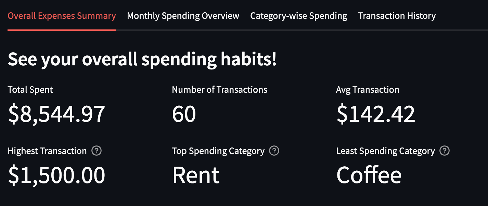

# personal-expense-dashboard
<a id="readme-top"></a>


<details>
  <summary>Table of Contents</summary>
  <ol>
    <li>
      <a href="#about-the-project">About The Project</a>
      <ul>
        <li><a href="#built-with">Built With</a></li>
      </ul>
    </li>
    <li>
      <a href="#getting-started">Getting Started</a>
      <ul>
        <li><a href="#prerequisites">Prerequisites</a></li>
        <li><a href="#installation">Installation</a></li>
      </ul>
    </li>
    <li><a href="#usage">Usage</a></li>
  </ol>
</details>


<!-- ABOUT THE PROJECT -->
## About The Project
This project is a personal expense dashboard that helps users visualize and analyze their spending habits through interactive charts, monthly summaries, and category-based insights. With detailed transaction breakdowns and dynamic filters, users can track their expenses over time, identify spending patterns, and make informed financial decisions.


<p align="right">(<a href="#readme-top">back to top</a>)</p>


### Built With

* [![Python][Python.py]][Python-url]
* [![Streamlit][Streamlit]][Streamlit-url]
* [![Pandas][Pandas]][Pandas-url]
* [![Plotly Express][Plotly Express]][Plotly Express-url]

<p align="right">(<a href="#readme-top">back to top</a>)</p>


<!-- GETTING STARTED -->
## Getting Started
To begin using the personal expense dashboard, follow the steps below:

### Prerequisites

1. **Prepare Your Expense File**  
   * Your CSV file must have the following columns in this exact format:  
     - `Date` (e.g., `2025-09-01`)  
     - `Amount` (e.g., `1500.00`)  
     - `Category` (e.g., `Rent`)  
     - `Description` (e.g., `September rent`)  

   * Sample row:
     ```csv
     Date,Amount,Category,Description
     09-01-2025,1500.00,Rent,September rent
     ```

   * You can also use the provided [sample CSV file](sample_data/sample_expenses.csv) to test the app.

### Installation

1. Clone the repo to your local machine:
   ```sh
   git clone https://github.com/MegsBl/personal-expense-dashboard.git
   ```
2. Navigate to the project directory:
    ```sh
    cd personal_expense_dashboard
    ```
3. Option but recommended: Create a virtual enviornment
    ```sh
    python3 -m venv venv
    source venv/bin/activate # On Windows use: venv\Scripts\activate
    ```
4. Install all the required dependencies:
   ```sh
   pip3 install -r requirements.txt
   ```
5. Change git remote url to avoid accidental pushes to base project
    ```sh
    git remote set-url origin github_username/repo_name
    git remote -v # confirm the changes
    ```
6. Run the Streamlit app:
    ```sh
   python3 -m streamlit run app.py
   ```
7. Upload your .csv file when prompted in the app interface to start exploring your spending habits.

<p align="right">(<a href="#readme-top">back to top</a>)</p>


## Usage

To get started, upload your personal expense CSV file when prompted on the main page of the app. The dashboard depends on this file to load and display your financial data. Make sure the file follows the required format with columns: Date, Amount, Category, and Description.

### The app has 4 main tabs for exploring your personal spending. Each of these tabs includes interactive charts and filters to help you analyze your expenses, track patterns, and gain insights into your financial habits:
1. **Overall Expenses Summary**:
* Provides a high-level overview of your total spending with key performance indicators (KPIs) like total spent, average transaction, and top spending category.


>* *There are also help tooltips on key KPI metrics that show details about specific transactions, such as the highest transaction’s category and description, giving you quick context without leaving the dashboard.*</br>

<p float="left">
  
  
  
</p>

* Includes visualizations such as:  
  - **Bar Chart for Daily Spending**: Helps you quickly identify which days had the highest expenses, making it easy to spot spending spikes or patterns throughout the month.  

  

  - **Cumulative Line Chart**: Shows how your spending accumulates over time, giving you insight into your overall budget progress and trends.  
  
  

  - **Pie Chart / Treemap for Spending Distribution**: Provides a clear breakdown of how your money is allocated across different categories, helping you understand where most of your expenses go.
  
  
  >* *The treemap allows you to tap to zoom into each category for deeper exploration.* </br>
  
  
  


2. **Monthly Spending Overview**: 
* Breaks down your expenses by month.
- **Stacked Bar Chart for Monthly Expenses**: Allows you to compare spending across different categories month by month, helping you identify trends, shifts in budget allocation, and areas where expenses may be increasing or decreasing over time.


- **Detailed Monthly Breakdown**: After selecting a month, you get a focused view of that month’s spending through KPIs, a category-wise pie chart, and a box plot showing the distribution of daily expenses, helping you understand spending variability within that month.


3. **Category-wise Spending**:
* Choose from different chart types (bar chart, pie chart, or tree map) to see total spending per category, explore spending distribution, or drill down into individual transactions by category and description.

* Select a specific category to view detailed metrics such as total spend, transaction count, and average transaction amount, along with a histogram displaying the distribution of transaction amounts within that category.


* This helps identify spending patterns, outliers, and frequent expense amounts, empowering you to manage your budget more effectively.

4. **Transaction History**:  
* Provides a detailed view of your transaction records, helping you review your largest and smallest expenses easily.  

* Choose to see the top 5 most expensive transactions or the top 5 least expensive ones, with each transaction showing the date, amount, category, and description for clear context.  


* A treemap visualization complements the list by highlighting the distribution of your top/least costly items, giving you a visual overview of where your money is going.

* You can also filter transactions by selecting one or more categories, allowing you to focus on specific areas of your spending.  


<p align="right">(<a href="#readme-top">back to top</a>)</p>

[Python.py]: https://img.shields.io/badge/python-3776AB?style=for-the-badge&logo=python&logoColor=white
[Python-url]: https://www.python.org/
[Streamlit]: https://img.shields.io/badge/Streamlit-00A3E0?style=for-the-badge&logo=streamlit&logoColor=white
[Streamlit-url]: https://streamlit.io/
[Pandas]: https://img.shields.io/badge/pandas-150458?style=for-the-badge&logo=pandas&logoColor=white
[Pandas-url]: https://pandas.pydata.org/
[Plotly Express]: https://img.shields.io/badge/Plotly%20Express-3F4F75?style=for-the-badge&logo=plotly&logoColor=white
[Plotly Express-url]: https://plotly.com/python/plotly-express/
[Matplotlib]: https://img.shields.io/badge/Matplotlib-3776AB?style=for-the-badge&logo=matplotlib&logoColor=white